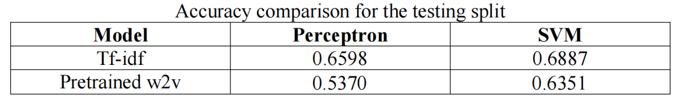
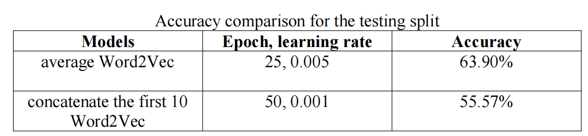
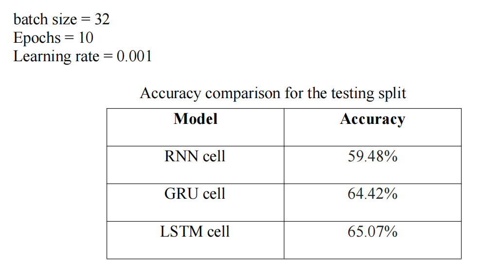

# Sentiment-Analysis-on-Amazon-Reviews-Dataset

This project was done in 2 parts as a part of CSCI-544 Applied NLP coursework
For complete detail check the report and code under Part-1 and Part-2 directory

#### Here is a gist of Part-1
## PART 1

 We performed text classsification for sentiment analysis using the amazon reviews dataset
 Details of data cleaing, pre-processing and feature extraction are given in the report. (check the document Part 1- Question under Part-1 directory)

### Then we compared the performance of 4 models:
 - Perceptron
 - SVM
 - Logistic Regression
 - Multinomial Naive Bayes

### Metrics for comparison:
We reported the Precision, Recall, and f1-score per class and their averages on the testing split of our dataset.

## Results

  |   
:-------------------------:|:-------------------------:
  |  

## PART 2

Extension of PART-1 we did 2 major changes
- pretrained “word2vec-google-news-300” was used for word embedding
- used deep learning models

### Models:
- feedforward multilayer perceptron
- Recurrent Neural Networks
    - simple RNN
    - GRU
    - LSTM

## Results:

## PART-1 model accuracy on tf-idf vs word2vec

## Feed forward Neural Network

## Recurrent Neural Networks

The reasoning for lesser accuracy is mentioned in the PART-2 report. 

 
