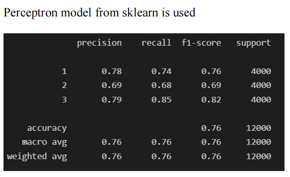

# Sentiment-Analysis-on-Amazon-Reviews-Dataset

#### This project was done in 2 parts as a part of CSCI-544 Applied NLP coursework
#### For complete detail check the report and code under Part-1 directory

#### Here is a gist of Part-1
## PART 1

#### We performed text classsification for sentiment analysis using the amazon reviews dataset
#### Details of data cleaing, pre-processing and feature extraction are given in the report. (check the document Part 1- Question under Part-1 directory)

### Then we compared the performance of 4 models:
 - Perceptron
 - SVM
 - Logistic Regression
 - Multinomial Naive Bayes

### Metrics for comparison:
We reported the Precision, Recall, and f1-score per class and their averages on the testing split of our dataset.

## Results

  |   
:-------------------------:|:-------------------------:
  |  

 
