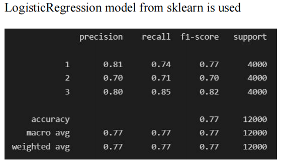
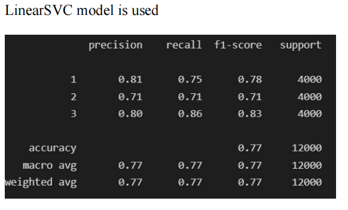
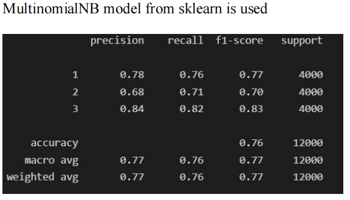

# Sentiment-Analysis-on-Amazon-Reviews-Dataset

### This project was done in 2 parts as a part of CSCI-544 Applied NLP coursework

## PART 1

### We performed text classsification for sentiment analysis using the amazon reviews dataset

### Details of data cleaing, pre-processing and feature extraction are given in the report. (check the document Part 1- Question under Part-1 directory)

### Then we compared the performance of 4 models:
 - Perceptron
 - SVM
 - Logistic Regression
 - Multinomial Naive Bayes

### Metrics for comparison:
We reported the Precision, Recall, and f1-score per class and their averages on the testing split of our dataset.

12 metrics per model:
(precision recall and f1-score)  *  (classes 1,2,3 and average) 

Results:

## Results

:-------------------------:|:-------------------------:
 Perceptron              |     Logistic
  |   
:-------------------------:|:-------------------------:
SVM            |                                 Naive Bayes   
  |  

 
